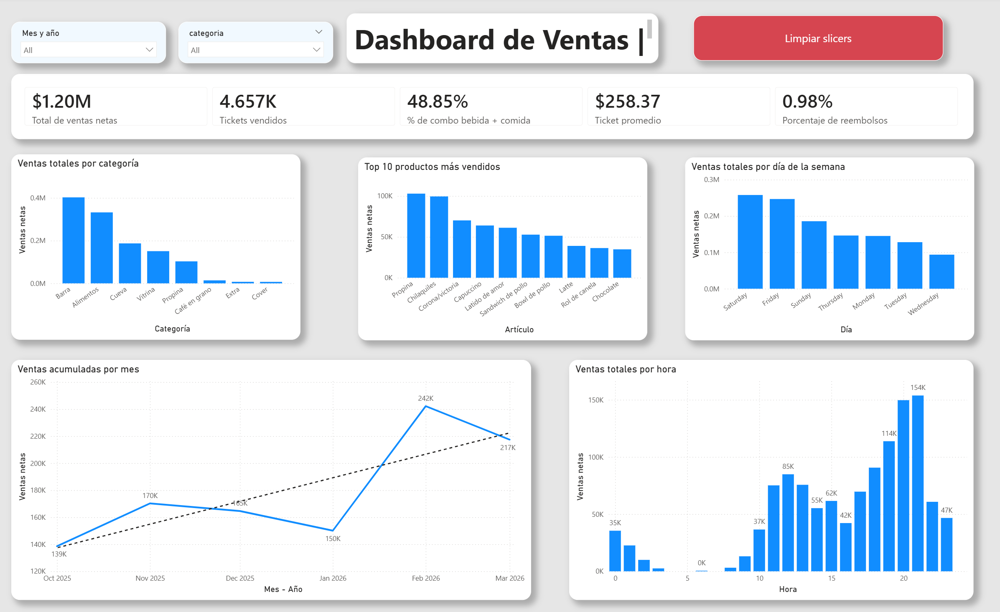

# 📊 Sales Analysis to Identify Low-Profitability Products  
### Coffee Shop Business Intelligence Case Study

> **English version first for U.S. recruiters and hiring managers**  
> *Versión en español más abajo.*

---

# 🇺🇸 English Version

## 📌 Project Overview

Sales analysis of a real coffee shop located in Cuernavaca, Mexico, focused on identifying low-profitability products, customer purchasing behavior, and revenue growth opportunities using **SQL** and **Power BI**.

The main objective was to transform historical sales data into actionable business decisions to increase revenue and optimize the product mix.

---

# 🧠 Business Problem

The coffee shop **Corazón de Piedra** had historical sales data available, but lacked visibility into:

- Which products generated the most value
- Which items underperformed
- When demand peaked during the week
- How to increase average ticket size without increasing customer traffic

### Stakeholders

- Business Owner / Management

---

# 📈 Featured Dashboard

The dashboard includes executive KPIs such as:

- Net Revenue
- Average Ticket Size
- Number of Transactions
- Monthly Sales Trend
- Sales by Category
- Top Selling Products
- Sales by Hour



### Why it matters

It helps quickly identify:

- Peak days and hours
- Best-selling products
- Cross-sell opportunities
- Weekend dependency
- Revenue trends

---

# 📂 Dataset

**Source:** Internal Point-of-Sale (POS) export  
**Size:** 16,656 rows / 23 columns  
**Format:** CSV → SQL Database → Power BI

### Key Variables

- `fecha` → Transaction date & time  
- `numero_de_recibo` → Receipt ID  
- `categoria` → Product category  
- `articulo` → Product name  
- `cantidad` → Units sold  
- `ventas_netas` → Net sales amount  
- `tipo_de_recibo` → Sale / Refund  
- `tipo_de_pedido` → Dine-in / Takeaway

### Data Quality Notes

- ~3% duplicate records removed
- Missing customer fields
- UTF-8 encoding issues fixed
- Some missing categories manually reclassified

---

# 🔍 Analysis Process

## 1. Exploratory Data Analysis (EDA)

- Sales distribution by category and product
- Revenue by day, month, and hour
- Average ticket analysis
- Top-selling products
- Cross-sell behavior (drink + food)

## 2. Data Cleaning / Preprocessing

- Null handling
- Duplicate removal
- Data type conversion
- Text normalization
- Encoding corrections
- Manual product categorization

## 3. Business Analysis

- KPI development
- Revenue opportunity sizing
- Product performance review
- Operational demand analysis

---

# 💡 Key Findings

📌 The coffee shop generated **$1.20M MXN** in less than one year.  

📌 Average ticket size reached **$258 MXN**, strong for a local coffee shop.  

📌 Only **48.85%** of tickets included both drink + food, showing cross-sell opportunity.  

📌 Friday, Saturday, and Sunday concentrated the highest demand.  

📌 Estimated potential of **+10% revenue growth** through ticket optimization and slow-day activation.

---

# 📈 Business Impact

### Estimated Revenue Drivers

- Increase average ticket size by 10%
- Improve food + drink bundle rate
- Activate low-performing weekdays
- Improve product mix decisions

### Estimated Outcome

**+$120K to +$180K MXN annual upside potential**

---

# 🛠️ Tools & Technologies

- SQL (MySQL)
- Power BI
- Excel
- Git
- GitHub

---

# 📁 Repository Structure

```text
📦 sales-analysis-coffee-shop
┣ 📂 SQL
┃ ┗ 📄 coffee_shop_analysis.sql
┣ 📂 dashboard
┃ ┗ 📄 coffee_shop_dashboard.pbix
┣ 📂 data
┃ ┗ 📄 clean_coffee_shop_data.csv
┣ 📂 images
┃ ┗ 📄 dashboard_preview.PNG
┣ 📄 README.md
┗ 📄 LICENSE
```

# How to Use This Project
- Clone Repository
- git clone https://github.com/EstebaLoOr/sales-analysis-coffee-shop.git
- cd sales-analysis-coffee-shop

# Open Files
- [SQL analysis](SQL/coffee_shop_analysis.sql)
- [Power Bi Dashboard](dashboard/coffee_shop_dashboard.pbix)
- [Data](data/clean_coffee_shop_data.csv)
- [For a more detailed explanation](documentation/coffee_shop_documentation_en.md)

#👤 Autor
### Esteban López Ortega
- [LinkedIn](https://www.linkedin.com/in/esteban-lopez-711527102/)
- [Github](https://github.com/EstebaLoOr)

⭐ Future Improvements
Customer retention / recurrence analysis
Product-level profitability
Demand forecasting
Executive automated dashboard
Loyalty program analytics

---

# 🇲🇽 Versión en Español

# 📊 Análisis de Ventas para Identificar Productos de Baja Rentabilidad  
### Caso de Business Intelligence para Cafetería

## 📌 Descripción General

Análisis de ventas de una cafetería real ubicada en Cuernavaca, Morelos, enfocado en detectar productos de baja rentabilidad, patrones de compra y oportunidades de crecimiento utilizando **SQL** y **Power BI**.

El objetivo principal fue transformar datos históricos en decisiones accionables para aumentar ingresos y optimizar el mix de productos.

---

# 🧠 Problema de Negocio

La cafetería **Corazón de Piedra** contaba con datos históricos de ventas, pero no tenía claridad sobre:

- Qué productos generan mayor valor
- Qué artículos presentan bajo desempeño
- En qué días y horarios se concentra la demanda
- Cómo aumentar el ticket promedio sin atraer más clientes

### Stakeholders

- Dueño / Dirección del negocio

---

# 📈 Dashboard Principal

El dashboard incluye KPIs ejecutivos como:

- Ventas netas
- Ticket promedio
- Número de tickets
- Tendencia mensual de ventas
- Ventas por categoría
- Productos más vendidos
- Ventas por hora


### ¿Por qué es importante?

Permite detectar rápidamente:

- Días y horarios pico
- Productos estrella
- Oportunidades de cross-selling
- Dependencia del fin de semana
- Tendencias de crecimiento

---

# 📂 Conjunto de Datos

**Fuente:** Exportación interna del sistema Punto de Venta (TPV)  
**Tamaño:** 16,656 filas / 23 columnas  
**Formato:** CSV → SQL Database → Power BI

### Variables clave

- `fecha` → Fecha y hora de la transacción  
- `numero_de_recibo` → ID del ticket  
- `categoria` → Categoría del producto  
- `articulo` → Nombre del producto  
- `cantidad` → Unidades vendidas  
- `ventas_netas` → Venta final después de descuentos  
- `tipo_de_recibo` → Venta o reembolso  
- `tipo_de_pedido` → Comer dentro / Para llevar

### Notas de calidad de datos

- Se eliminaron ~3% de registros duplicados
- Existían campos de cliente vacíos
- Se corrigieron errores de codificación UTF-8
- Algunas categorías fueron reclasificadas manualmente

---

# 🔍 Proceso de Análisis

## 1. Análisis Exploratorio (EDA)

- Distribución de ventas por categoría y producto
- Ventas por día, mes y hora
- Análisis de ticket promedio
- Productos más vendidos
- Comportamiento de ventas cruzadas (bebida + alimento)

## 2. Limpieza / Preprocesamiento

- Tratamiento de valores nulos
- Eliminación de duplicados
- Conversión de tipos de datos
- Normalización de texto
- Corrección de encoding
- Reclasificación manual de productos

## 3. Análisis de Negocio

- Desarrollo de KPIs
- Estimación de oportunidades de crecimiento
- Evaluación de desempeño por producto
- Análisis operativo de la demanda

---

# 💡 Principales Hallazgos

📌 La cafetería generó **$1.20M MXN** en menos de un año.  

📌 El ticket promedio fue de **$258 MXN**, sólido para una cafetería local.  

📌 Solo **48.85%** de tickets incluyeron bebida + alimento, mostrando oportunidad clara de cross-selling.  

📌 Viernes, sábado y domingo concentran la mayor demanda.  

📌 Existe un potencial estimado de **+10% en ingresos** mediante optimización del ticket promedio y activación de días lentos.

---

# 📈 Impacto de Negocio

### Principales palancas de crecimiento detectadas

- Incrementar ticket promedio en 10%
- Mejorar tasa de combos bebida + alimento
- Activar martes y miércoles
- Optimizar decisiones de mix de productos

### Resultado estimado

**+$120K a +$180K MXN de potencial anual**

---

# 🛠️ Herramientas y Tecnologías

- SQL (MySQL)
- Power BI
- Excel
- Git
- GitHub

---

# 📁 Estructura del Repositorio

```text
📦 sales-analysis-coffee-shop
┣ 📂 SQL
┃ ┗ 📄 coffee_shop_analysis.sql
┣ 📂 dashboard
┃ ┗ 📄 coffee_shop_dashboard.pbix
┣ 📂 data
┃ ┗ 📄 clean_coffee_shop_data.csv
┣ 📂 images
┃ ┗ 📄 dashboard_preview.PNG
┣ 📄 README.md
┗ 📄 LICENSE
```

# Cómo Usar Este Proyecto
### Clonar repositorio
- git clone https://github.com/EstebaLoOr/sales-analysis-coffee-shop.git
- cd sales-analysis-coffee-shop

# Abrir archivos
- [SQL analysis](SQL/coffee_shop_analysis.sql)
- [Power Bi Dashboard](dashboard/coffee_shop_dashboard.pbix)
- [Data](data/clean_coffee_shop_data.csv)
- [Para ver el análisis completo](documentation/coffee_shop_documentation_es.md)

#👤 Autor
### Esteban López Ortega
- [LinkedIn](https://www.linkedin.com/in/esteban-lopez-711527102/)
- [Github](https://github.com/EstebaLoOr)

⭐ Mejoras Futuras
Análisis de recurrencia de clientes
Rentabilidad real por producto
Forecast de demanda
Dashboard ejecutivo automatizado
Programa de lealtad basado en datos
